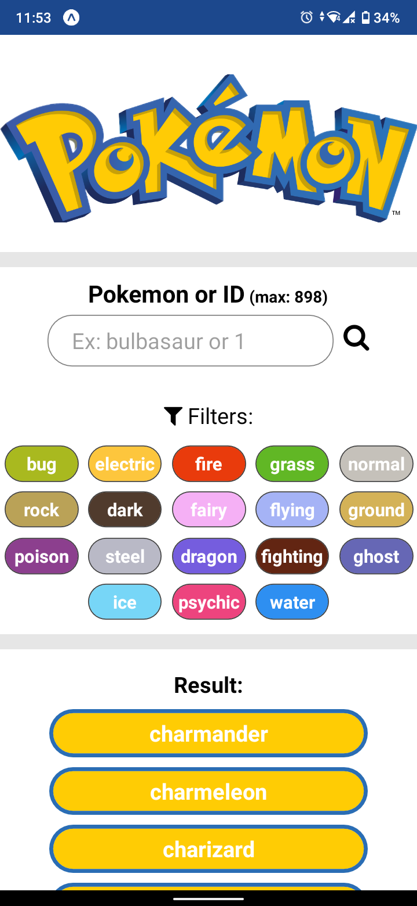
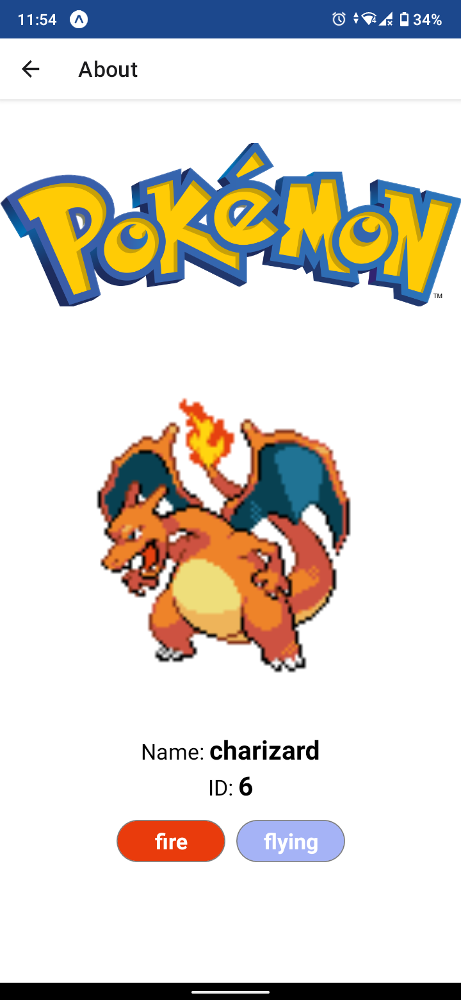

# Pokedéx

 

# Sobre
O app da pokedéx foi construído em React Native com Expo, faz uso da lib React-Navigation para navegação entre telas e Context API como gerenciador de estados. Além disso, toda consulta de dados é feita na PokeAPI, uma API pública e grátis com uma imensidão de dados a respeito de Pokemon.

# Instalação
Fiz o build do APK para quem tiver interesse em baixar: [APK](https://drive.google.com/drive/folders/1hRRLk7RzLmiAoLQvjSz8E3gzzjbPh905?usp=sharing)
E também deixo aqui o passo a passo para instalação na sua IDE:
1. `git clone git@github.com:greedu/pokedex.git`
2. `npm install` ou `yarn install` para instalação das dependências
3. `npm start` ou `yarn start` para inicializar no Expo (**certifique-se de ter o Expo instalado na sua máquina**)
